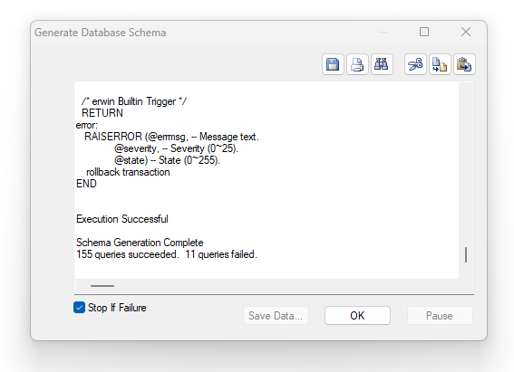

# Midterm Individual Portion

### Fordward Engineering Log

Overall, my model coul user more defaults and check constraints, a CDM and LDM, subject areas and Foreign Key Relationship names as the professor requested

<!-- ### Physical Model View -->

<!--  -->

<!--  -->

# Peer Review

- [x] Jasminder Garcha
- [x] Amber Garcia
- [ ] Oliver Vidal
- [ ] Wade Li

---

### `Jasminder Garcha`
Great use of the color schemes for the different types of entities. Your validation rules and defaults are thorough.

A few errors when forward engineering but here's how to fix. 
1. on the Production.Product View, uncheck the user defined SQL (1 instance)
2. the automated triggers use the table names in the sql. The problem is the table "Order" because order is also a keyword. Change the Order table to Orders, or change the triggers and wrap the word order in brackets (10 instances)

- [ ] CDM and LDM
- [x] Validation Rules
- [x] Default values forattributes
- [x] Data Domains and subdomains

### `Amber Garcia`

Overall excellent work, great addition of theme to your Model, I was able to forward engineer it without any errors. 
- [ ] CDM and LDM
- [x] Validation Rules
- [x] Default values forattributes
- [x] Data Domains and subdomains

